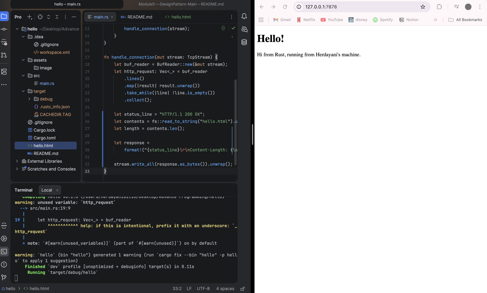
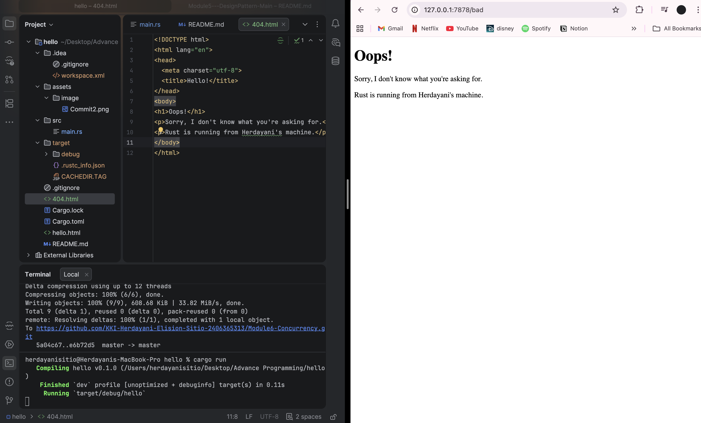
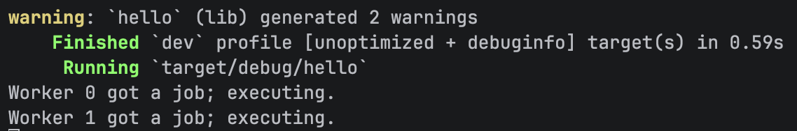

## MODULE6

### Commit 1
Inside the hand
le_connection function, I add BufReader to read the data from the TCP stream.
By using the .lines() method and collecting them into a Vec, I am able to see the raw HTTP request sent
by the browser in the console.
This helped me understand that a request is basically just a series of text lines containing information about
what the browser wants.

### Commit 2

I learned that an HTTP response needs a specific format which are a status line, headers, and the message body.
I used the fs module to read the contents of an external HTML file called hello.html.
I then calculated the length of that content and formatted it into a  HTTP response string.
Lastly, i used stream.write_all to send that data back, which allowed the browser to actually render a webpage.

### Commit 3

I learned how to make the server respond differently depending on the request.
First i checked the first line of the HTTP request to see if the user was asking for the root path (/).
If the request matched GET / HTTP/1.1, the server would return the successful 200 OK status and the hello.html file.
However, if the request was for anything else, the server would return a 404 NOT FOUND status and a separate 404.html file.
This taught me how to handle basic routing and how to manage errors when a page does not exist.

### Commit 4
In this milestone i learned about the limitations of a single threaded server
Here i added a new path, /sleep, that uses thread::sleep to pause the server for about 10 seconds before responding.
After i try to run it and visit the page, i noticed that while the server is "sleeping" for one window,
it cannot handle any other requests.
If I try to open the homepage in a second window while the first one is loading /sleep, the second window has to wait until the 10 seconds are over.
This showed me why single threaded servers are not efficient for multiple users.

### Commit 5

In the final milestone, I make the server multithreaded based on the rust programming book given in the pdf. 
Instead of handling one connection at a time, using a ThreadPool will manage multiple connections simultaneously.
When a new request comes in, the server now assigns the task to a worker thread from the pool. 
This solves the problem from the previous commit.
With it now, a slow request like /sleep will not block other users from accessing the homepage, because each request is handled by a different thread.
